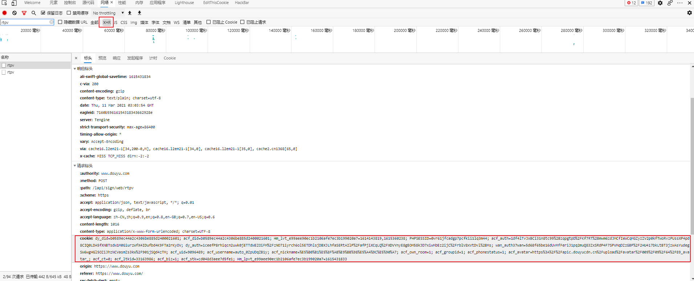
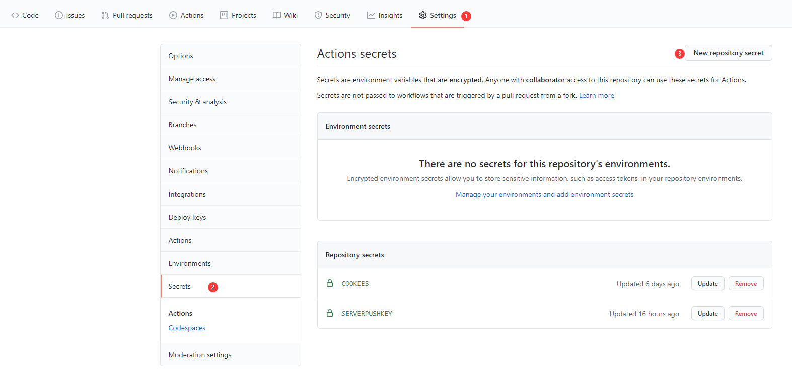
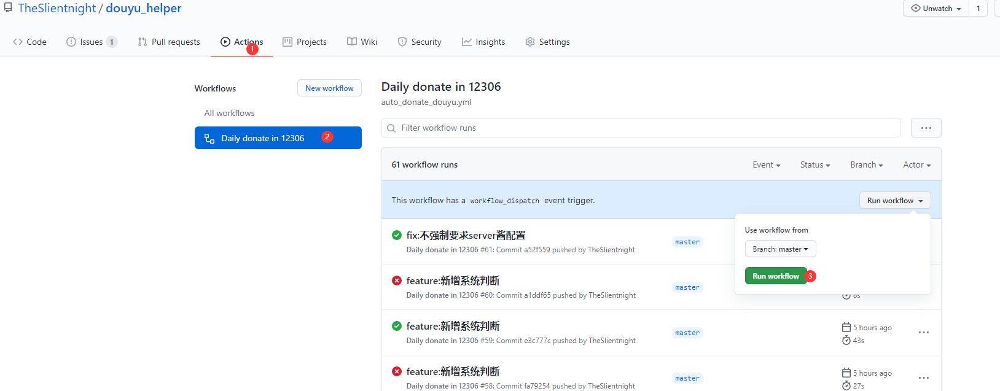
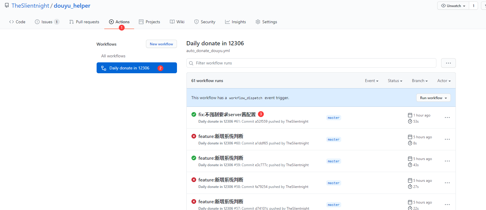
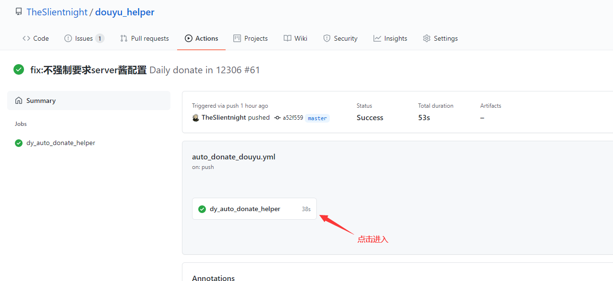
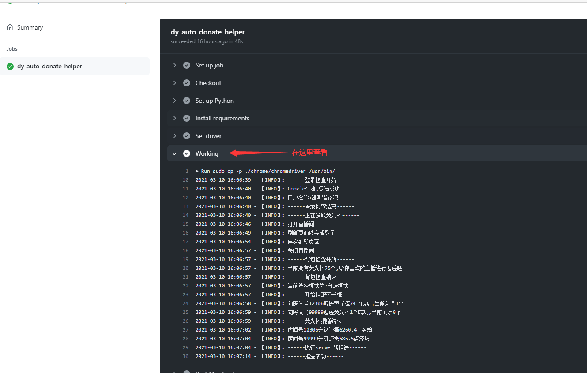

<div align="center">
<h1 align="center">
DouYu-Helper
</h1>

[](https://github.com/TheSlientnight/douyu_helper/stargazers)
[](https://github.com/TheSlientnight/douyu_helper/network)
[](https://github.com/TheSlientnight/douyu_helper/issues) 
[](https://github.com/TheSlientnight/douyu_helper/releases)
[](https://github.com/TheSlientnight/douyu_helper/graphs/contributors)

</div>

## 工具简介
利用Github Action的方式实现斗鱼TV自动获取粉丝荧光棒，并完成赠送工具，简单配置即可实现赠送每日赠送荧光棒

**如果认为工具还算好用，请顺手点一个Star吧~**

## 功能列表
* [x] 每天上午9点启动
* [x] 自动获取荧光棒
* [x] 自定义赠送的房间
* [x] 平均分配荧光棒至拥有粉丝牌的房间
* [x] 推送日志

# 目录
- [目录](#目录)
    - [使用说明](#使用说明)
      - [一、Actions方式](#一、Actions方式)
      - [二、本地执行](#二、本地执行)

## 使用说明

### 一、Actions方式
1. **Fork本项目**
2. **获取自己斗鱼账号的COOKIE**
3. 使用浏览器登录[斗鱼](https://www.douyu.com)
4. 按下F12打开[开发者工具]，在[网络/network]中打开筛选，选择XHR
5. 随意点击一个请求,将请求头中的cookie复制出来

   
6. 在项目内点击Setting -> Secrets -> New Secrets,并添加获取到的COOKIES

| Name        | Value                    |
|-------------|--------------------------|
|COOKIES      |按步骤5获取                 |
|SERVERPUSHKEY|server酱(Turbo版)的推送sckey|

7. **开启Actions 并触发每日自动执行**
   **Fork仓库之后，GitHub默认不自动执行Actions任务,请手动执行一次以检查工作流**
   
   
8. 如果需要修改每日执行任务的时间,请修改`.github/auto_donate_douyu.yaml`下的`schedule`
```yml
  schedule:
    - cron: '00 1 * * *'
    # cron表达式，Actions时区是国际时间，国际时间1点的时候，国内时间是早上9点。
    # 示例： 每天晚上22点30执行 '30 14 * * *'
```
如果收到了 GitHub Action 的错误邮件，请检查 Cookies 是不是失效了，用户修改密码、踢除设备下线，会导致 COOKIES 失效

请各位使用 Actions 时务必遵守Github条款。不要滥用Actions服务。

Please be sure to abide by the Github terms when using Actions. Do not abuse the Actions service.

**查看Actions运行日志**
1. 进入Actions执行结果
    
2. 查看执行详情
    
3. 查看执行日志
    
   
[日志示例](https://github.com/TheSlientnight/douyu_helper/runs/2078519193?check_suite_focus=true)

### 二、本地执行
* [ ] 待补充